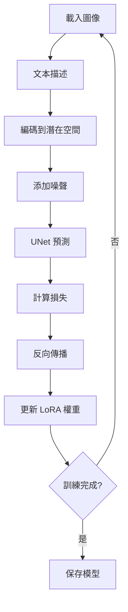

# 🤖 Mega Man LoRA 訓練系統 🎮

一個完整的 LoRA (Low-Rank Adaptation) 訓練系統，用於生成 Mega Man 風格的圖像。基於 Stable Diffusion 和 PEFT 庫實現。

## 📋 目錄

- [功能特點](#功能特點)
- [系統要求](#系統要求)
- [安裝指南](#安裝指南)
- [快速開始](#快速開始)
- [詳細使用說明](#詳細使用說明)
- [訓練技巧](#訓練技巧)
- [故障排除](#故障排除)
- [技術原理](#技術原理)

## 🌟 功能特點

- **高效的 LoRA 訓練**: 使用低秩適應技術，大幅減少訓練參數
- **自動數據處理**: 支持多種圖像格式，自動生成描述
- **靈活的配置**: 豐富的命令行參數，支持各種訓練策略
- **記憶體優化**: 支持混合精度、梯度累積等優化技術
- **實時監控**: 訓練過程中生成示例圖像，支援 TensorBoard
- **完整的推理系統**: 包含圖像生成和結果展示功能

## 💻 系統要求

### 硬體要求
- **GPU**: NVIDIA GPU (8GB+ VRAM 推薦)
- **記憶體**: 16GB+ RAM
- **存儲**: 20GB+ 可用空間

### 軟體要求
- **Python**: 3.8+
- **CUDA**: 11.8+ (如果使用 GPU)
- **操作系統**: Windows 10+, Linux, macOS

## 📦 安裝指南

### 1. 克隆或下載代碼
```bash
# 如果使用 git
git clone <repository-url>
cd megaman-lora

# 或直接下載文件到您的工作目錄
```

### 2. 創建虛擬環境
```bash
# 使用 conda
conda create -n megaman-lora python=3.9
conda activate megaman-lora

# 或使用 venv
python -m venv megaman-lora
# Windows
megaman-lora\Scripts\activate
# Linux/macOS
source megaman-lora/bin/activate
```

### 3. 安裝依賴
```bash
pip install -r requirements_megaman_lora.txt
```

### 4. 驗證安裝
```python
python -c "import torch; print(f'PyTorch: {torch.__version__}'); print(f'CUDA 可用: {torch.cuda.is_available()}')"
```

## 🚀 快速開始

### 1. 準備訓練數據

首先運行訓練腳本來創建數據目錄：

```bash
python megaman_lora.py
```

這會創建 `megaman_images` 目錄並生成說明文件。

#### 數據組織結構：
```
megaman_images/
├── megaman_01.png
├── megaman_01.txt  (可選描述文件)
├── megaman_x_02.jpg
├── megaman_x_02.txt
├── boss_robot_03.png
└── ...
```

#### 圖像要求：
- **格式**: JPG, PNG, BMP, WebP
- **分辨率**: 512x512 或更高
- **數量**: 20-100+ 張圖像 (越多越好)

#### 描述文件示例：
```text
# megaman_01.txt
mega man, blue robot, helmet, game character, detailed armor

# megaman_x_02.txt  
mega man X, futuristic armor, blue and white, action pose, sci-fi

# boss_robot_03.txt
robot master, colorful armor, unique design, game boss, threatening
```

### 2. 開始訓練

#### 基本訓練：
```bash
python megaman_lora.py \
    --data_dir ./megaman_images \
    --output_dir ./megaman_lora_output \
    --max_train_steps 1000
```

#### 推薦配置：
```bash
python megaman_lora.py \
    --data_dir ./megaman_images \
    --output_dir ./megaman_lora_output \
    --resolution 512 \
    --train_batch_size 1 \
    --gradient_accumulation_steps 4 \
    --learning_rate 1e-4 \
    --lora_rank 8 \
    --lora_alpha 32 \
    --max_train_steps 1500 \
    --save_steps 250 \
    --validation_steps 100 \
    --mixed_precision fp16
```

### 3. 生成圖像

訓練完成後，使用以下命令生成圖像：

```bash
python generate_megaman.py \
    --lora_path ./megaman_lora_output/lora_weights \
    --output_dir ./generated_megaman
```

生成的圖像會保存到 `generated_megaman` 目錄，並創建 HTML 畫廊檢視器。

## 📖 詳細使用說明

### 訓練參數詳解

#### 基本參數
- `--pretrained_model_name`: 基礎模型 (預設: runwayml/stable-diffusion-v1-5)
- `--data_dir`: 訓練數據目錄
- `--output_dir`: 輸出模型目錄
- `--resolution`: 圖像分辨率 (建議 512 或 768)

#### LoRA 參數
- `--lora_rank`: LoRA 秩 (4-16, 越高越複雜)
- `--lora_alpha`: LoRA alpha (通常為 rank 的 2-8 倍)

#### 訓練參數
- `--learning_rate`: 學習率 (建議 1e-4 到 5e-5)
- `--train_batch_size`: 批次大小 (取決於 GPU 記憶體)
- `--gradient_accumulation_steps`: 梯度累積 (用於增加有效批次大小)
- `--max_train_steps`: 總訓練步數

#### 優化參數
- `--mixed_precision`: 混合精度 (fp16/bf16，節省記憶體)
- `--gradient_checkpointing`: 梯度檢查點 (節省記憶體但稍慢)

### 生成參數詳解

#### 質量控制
- `--num_inference_steps`: 推理步數 (25-50)
- `--guidance_scale`: CFG 比例 (7.5-15.0)
- `--negative_prompt`: 負面提示詞

#### 輸出控制
- `--num_images_per_prompt`: 每個提示詞生成的圖像數
- `--height/width`: 輸出圖像尺寸
- `--seed`: 隨機種子 (用於重現結果)

## 🎯 訓練技巧

### 數據準備技巧

1. **圖像質量**: 使用高質量、清晰的圖像
2. **多樣性**: 包含不同角度、姿勢、風格的圖像
3. **描述質量**: 準確描述圖像內容，使用相關關鍵詞
4. **一致性**: 保持描述風格的一致性

### 訓練策略

1. **起始配置**:
   ```bash
   --lora_rank 4 --lora_alpha 16 --learning_rate 1e-4 --max_train_steps 1000
   ```

2. **高質量配置**:
   ```bash
   --lora_rank 8 --lora_alpha 32 --learning_rate 5e-5 --max_train_steps 2000
   ```

3. **專業配置**:
   ```bash
   --lora_rank 16 --lora_alpha 64 --learning_rate 2e-5 --max_train_steps 3000
   ```

### 監控訓練

1. **查看日誌**: 注意損失值的變化趨勢
2. **檢查示例**: 定期查看生成的示例圖像
3. **調整參數**: 根據結果調整學習率和訓練步數

## 🔧 故障排除

### 常見問題

#### 1. 記憶體不足 (CUDA out of memory)
**解決方案**:
```bash
# 減少批次大小
--train_batch_size 1

# 增加梯度累積
--gradient_accumulation_steps 8

# 使用混合精度
--mixed_precision fp16

# 降低分辨率
--resolution 512
```

#### 2. 訓練速度太慢
**解決方案**:
```bash
# 啟用 xformers (如果可用)
pip install xformers

# 使用更大的批次大小
--train_batch_size 2

# 減少驗證頻率
--validation_steps 200
```

#### 3. 生成質量差
**可能原因及解決方案**:
- **訓練不足**: 增加 `--max_train_steps`
- **學習率過高**: 降低 `--learning_rate`
- **數據質量**: 檢查訓練圖像和描述
- **LoRA 參數**: 調整 `--lora_rank` 和 `--lora_alpha`

#### 4. 生成圖像不像 Mega Man
**解決方案**:
- 確保訓練數據包含足夠的 Mega Man 圖像
- 檢查描述文件是否包含相關關鍵詞
- 增加訓練步數
- 調整提示詞

### 除錯技巧

1. **檢查數據載入**:
   ```python
   # 在訓練開始前檢查數據
   python -c "from megaman_lora import MegaManDataset; ds = MegaManDataset('./megaman_images', None); print(f'找到 {len(ds)} 張圖像')"
   ```

2. **監控 GPU 使用**:
   ```bash
   nvidia-smi -l 1  # 每秒更新 GPU 狀態
   ```

3. **檢查生成質量**:
   ```bash
   # 每 100 步生成示例
   --validation_steps 100
   ```

## 🔬 技術原理

### LoRA (Low-Rank Adaptation)

LoRA 是一種參數高效的微調技術：

1. **原理**: 將權重更新分解為低秩矩陣
2. **優勢**: 
   - 大幅減少可訓練參數 (通常 < 1%)
   - 訓練速度快，記憶體需求低
   - 可以與原模型分離儲存
3. **數學表示**: `W = W₀ + AB`，其中 A 和 B 是低秩矩陣

### Stable Diffusion 微調

1. **目標**: 讓模型學習 Mega Man 的視覺特徵
2. **過程**: 
   - 編碼圖像到潛在空間
   - 添加噪聲並預測去噪方向
   - 最小化預測誤差
3. **關鍵**: 文本-圖像的對應關係

### 訓練流程



## 📚 進階功能

### 自定義提示詞文件

創建 `prompts.txt` 文件：
```text
mega man, blue robot, helmet, detailed
mega man X, futuristic armor, action pose
classic mega man, 8-bit style, retro
robot master, unique design, colorful
```

使用：
```bash
python generate_megaman.py --prompts_file prompts.txt
```

### 批量生成

```bash
# 生成大量圖像
python generate_megaman.py \
    --num_images_per_prompt 4 \
    --num_inference_steps 50 \
    --guidance_scale 10.0
```

### 高分辨率生成

```bash
python generate_megaman.py \
    --height 768 \
    --width 768 \
    --num_inference_steps 50
```

## 📝 使用授權

本代碼僅供學習和研究使用。生成的圖像請遵守相關版權法律。

## 🤝 貢獻

歡迎提交問題報告和改進建議！

## 📧 聯繫

如有問題，請創建 Issue 或聯繫開發者。

---

**祝您訓練愉快！希望生成出精彩的 Mega Man 圖像！** 🎮✨ 